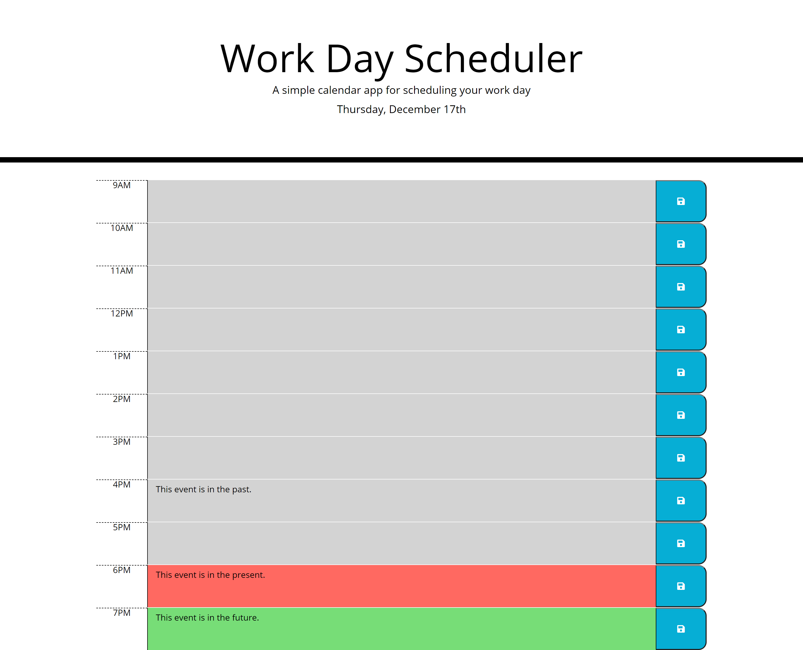

# day-planner

## Description
The Work Day Planner allows the user to enter their scheduled events by the hour.  When the web page is closed or refreshed, the event will remain on the page.  In addition, the page is synced with moments.js, so the date is updated automatically each day, and the hours are dynamic such that the colors will reflect whether the scheduled event is in the past, present or future.

To see the final result, you can view the webpage live at [day-planner](https://jacquie24.github.io/day-planner/).

## Usage
Once the page is loaded, the user may enter their scheduled event into the center text area next to the corresponding hour.  Upon clicking the submit button to the right, the event will be stored in the calendar.  The current hour will be highlighted in red, so the user knows it is time for that event.  After the time has passed, those hours will be in gray.  Future events are colored green.  The correct date and day of the week are displayed at the top of the page.  This image demonstrates the calendar's capability. 

## Installation
To view this webpage and any others I've designed, check out my GitHub repository at [Jacquie24](https://github.com/Jacquie24?tab=repositories).  

## Credits
I had a lot of help from my classmates in the Discord last night, especially Pete Kriengsiri, Nathan Castaldi, and Molly McCollum.  They were able to help me figure out which CSS styles matched up with which rows and were champions at code debugging as well. (Oh, curly braces, why are you always without your partner?)  Also, I had to research a lot on local storage.  [w3schools](https://www.w3schools.com/default.asp) was a big help with that.

## License
This page is using the [MIT](./license.txt) license.

